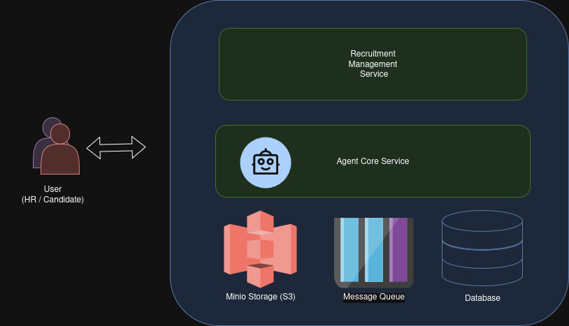

# RECRUITMENT AGENT

The Recruitment Agent service is a system that provides functionalities for managing recruitment jobs and applicant submissions, while leveraging the power of LLMs to automatically score candidates based on the specific jobs they apply for.

## Table of Contents
1. [Introduction](#introduction)
2. [Features](#features)
3. [System Components](#system-components)
4. [Installation](#installation)
5. [Contact](#Contact)
---

## Introduction

The Recruitment Agent Service is a backend system designed to streamline the recruitment process by managing job postings, handling candidate applications, and leveraging the power of Large Language Models (LLMs) to automatically evaluate and score candidates.

Built with FastAPI, PostgreSQL, and MinIO, the service provides a set of secure REST APIs for recruiters and administrators to:

    - Create and manage job postings.

    - Upload and store candidate CVs.

    - Automatically score candidates against job requirements.

    - Retrieve and review scoring results.

The system is containerized with Docker, making it easy to deploy in both development and production environments, and is fully documented via OpenAPI for smooth integration with frontend applications or third-party platforms.

## Features
Core Service Features
1. Job Service

    - Create, update, delete, and retrieve job postings.

    - Store job descriptions, requirements, and metadata.

    - Link jobs with applicants who have applied.

2. Candidate Service

    - Create and manage candidate profiles.

    - Associate candidates with specific jobs.

    - Upload and store CVs and related documents in MinIO.

    - Retrieve candidate information and application history.

3. Candidate Scoring Service

    - Take candidate information + job requirements → send to LLM for scoring.

    - Store the score and analysis results for each candidate per job.

    - Provide APIs to retrieve scores for evaluation purposes.

4. User Service

    - Manage user accounts (recruiters, admins).

    - Handle authentication and role-based access control.

    - Manage login tokens and secure API endpoints.

## System Components

There are 5 main components in this system, including:

There are five main components in this system:

- **Recruitment Management Service**: Manages candidates, jobs, and users who use the service.  
- **Agent Core Service**: Implements the LLM Agent that extracts and evaluates candidates against their corresponding jobs.  
- **MinIO Storage**: An object storage service used to store unstructured data (e.g., PDF resumes) in a secure and consistent manner.  
- **Message Queue**: Handles the processing of candidate evaluations and job executions performed by the LLM Agent.  
- **System Database**: Stores structured data for the management system, including candidates, users, jobs, and user permissions.  





## Installation

To run the entire system, you need to create a `.env` file in both `agents_recruitment/` and `core/` directories.

### `.env` file for `core/`:

```env
LLM_API_KEY="your-llm-api-key"
TOKEN="your-self-created-token-for-auth-core"

POSTGRES_DB="recruitment"
POSTGRES_USER="postgres"
POSTGRES_PASSWORD="recruitment"
POSTGRES_HOST="127.0.0.1"
POSTGRES_PORT="5432"

MINIO_ENDPOINT="minio-hostname:9000"
MINIO_ACCESS_KEY="your-access-key"
MINIO_SECRET_KEY="your-secret-key"
MINIO_BUCKET_NAME="recruitment"
```

### `.env` file for `agents_recruitment/`:

```env
SECRET_KEY="your-self-created-secret-key"

HR_ADMIN_USERNAME="hradmin"
HR_ADMIN_PASSWORD="HR_Admin_Password@123456"

POSTGRES_DB="recruitment"
POSTGRES_USER="postgres"
POSTGRES_PASSWORD="recruitment"
POSTGRES_HOST="your-postgres-host"
POSTGRES_PORT="5432"

MINIO_ENDPOINT="your-minio-host:9000"
MINIO_ACCESS_KEY="n8shHI8k1w4WpZk54PeL"
MINIO_SECRET_KEY="kC9tqlrI7xP1d6WlOzhgIfirvjcUUrnGiRVAIoCq"
MINIO_BUCKET_NAME="recruitment"

TMP_CANDIDATE_FILE="tmp_candidate.pdf"

```

### Start the Services

Run the following command in each directory in this order:

1. `minio/`  
2. `postgres/`  
3. `core/`  
4. `agents_recruitment/`  

```bash
docker compose up -d
```

**Ports:**  
- **agents_recruitment**: `8000`  
- **core**: `8001`  

## Contact
- Author: anhnd 
- Email: duyanh2132002@gmail.com


